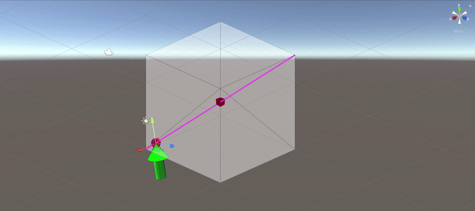
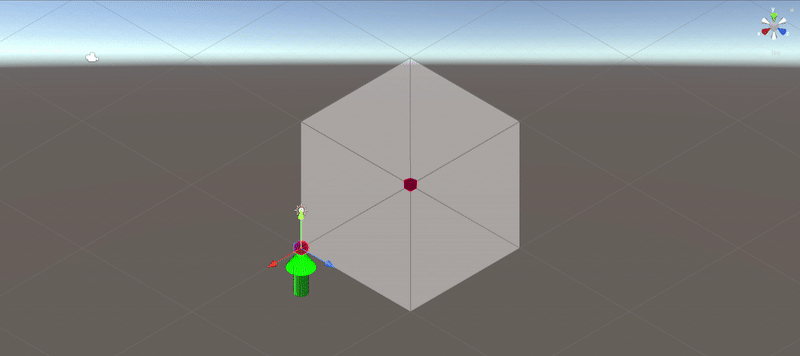
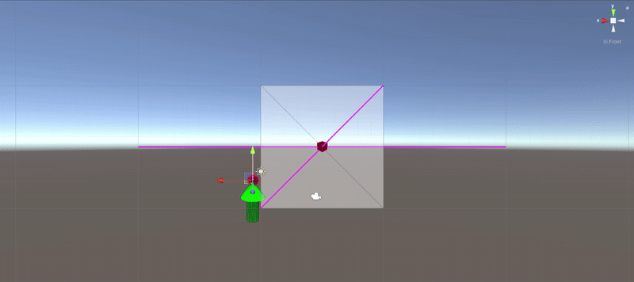
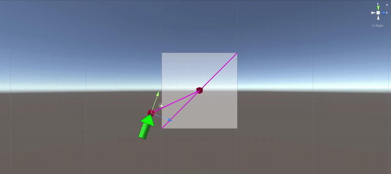

# Dual Quaternion Interpolation in Unity

---

## Overview

This repo discusses two possible ways to interpolate rigid body motions in Unity. 

The scripts were tested in Unity `v2020.3.f25f1`.

## Independent SLERP + LERP Interpolation

In Unity, coordinate frames or poses are represented by `Quaternion` (representing rotation), and `Vector3` (representing translation).

Each component (rotation or translation) has its respective interpolation method implemented out-of-the-box in Unity, to transition smoothly from one pose to another. Namely, they are `Quarternion.Slerp` for interpolating rotations and `Vector3.Lerp` for interpolating translations.

One direct way to interpolate rigid body motion in $\mathbb{SE(3)}$ is to interpolate two distinct poses independently in their rotation and translation component.



<div style='text-align:center'><i>Figure 1 - Independent SLERP + LERP interpolation.</i></div>

The code snippet below shows how to achieve this rigid body motion interpolation with built-in Unity functionalities.

```c#
public class MoveIndependent : MonoBehaviour
{
    Quaternion startRotation;
    Quaternion endRotation;
    Vector3 startPosition;
    Vector3 endPosition;
    LineRenderer lr0;

    int totalFrames = 50*10;
    int counter;

    // Start is called before the first frame update
    void Start()
    {
        lr0 = new GameObject().AddComponent<LineRenderer>();
        lr0.gameObject.transform.SetParent(transform);
        lr0.gameObject.transform.SetPositionAndRotation(Vector3.zero, Quaternion.identity);

        startRotation = Quaternion.Euler(0f, 0f, 0f);
        startPosition = Vector3.zero;

        endPosition = new Vector3(-10f, 10f, 10f);
        endRotation = Quaternion.Euler(180f,0f,0f);

        counter = 0;

        transform.position = startPosition;
        transform.rotation = startRotation;
    }

    private void FixedUpdate() {
        if (counter < totalFrames) {
            counter += 1;
            // interpolation
            transform.rotation = Quaternion.Slerp(startRotation, endRotation, (float)counter / totalFrames);
            transform.position = Vector3.Lerp(startPosition, endPosition, (float) counter / totalFrames);

            // visualization
            List<Vector3> line0 = new List<Vector3> { startPosition, endPosition };
            lr0.startWidth = 0.1f;
            lr0.endWidth = 0.1f;
            lr0.SetPositions(line0.ToArray());
        }
        
    }
}
```

Full script: <a href='src/MoveIndependent.cs'>MoveIndependent.cs</a>

## Screw Linear Interpolation (ScLERP) with Dual Quaternions

Alternatively, one can interpolate rigid body motion between two poses along a screw motion as illustrated below:

<div></div>

<div style='text-align:center'><i>Figure 2 - Perspective view of a screw motion.</i></div>

<br/>

<span></span><span></span>

<div style='text-align:center'><i>Figure 3 - Left: Side view of a screw motion. Right: Coaxial view of a screw motion.</i></div>

The code snippet below shows how to achieve this rigid body motion interpolation using a custom defined class `DualQuat`.

```c#
public class MoveDQ : MonoBehaviour
{
    Quaternion startRotation;
    Quaternion endRotation;
    Vector3 startPosition;
    Vector3 endPosition;
    DualQuat startDQ;
    DualQuat endDQ;
    LineRenderer lr0;
    LineRenderer lr1;
    LineRenderer lr2;

    int totalFrames = 50*10;
    int counter;

    // Start is called before the first frame update
    void Start() {
        lr0 = new GameObject().AddComponent<LineRenderer>();
        lr0.gameObject.transform.SetParent(transform);
        lr0.gameObject.transform.SetPositionAndRotation(Vector3.zero, Quaternion.identity);

        lr1 = new GameObject().AddComponent<LineRenderer>();
        lr1.gameObject.transform.SetParent(transform);
        lr1.gameObject.transform.SetPositionAndRotation(Vector3.zero, Quaternion.identity);

        lr2 = new GameObject().AddComponent<LineRenderer>();
        lr2.gameObject.transform.SetParent(transform);
        lr2.gameObject.transform.SetPositionAndRotation(Vector3.zero, Quaternion.identity);

        startRotation = Quaternion.Euler(0f, 0f, 0f);
        startPosition = Vector3.zero;
        startDQ = DualQuat.FromPose(startRotation, startPosition);

        endPosition = new Vector3(-10f, 10f, 10f);
        endRotation = Quaternion.Euler(180f, 0f, 0f);
        endDQ = DualQuat.FromPose(endRotation, endPosition);

        counter = 0;

        transform.position = startPosition;
        transform.rotation = startRotation;
    }

    private void FixedUpdate() {
        if (counter < totalFrames) {
            counter += 1;
            // interpolation
            var dq = DualQuat.Interpolate(startDQ, endDQ, (float)counter / totalFrames);
            DualQuat.ToPose(dq, out var rotation, out var position);
            transform.rotation = rotation;
            transform.position = position;

            // visualization
            DualQuat.ToScrew(endDQ, out var theta, out var axis, out var d, out var moment);
            var p = Vector3.Cross(axis, moment);
            var pStart = p - 20 * axis;
            var pEnd = p + 10 * axis;

            List<Vector3> line0 = new List<Vector3> { startPosition, endPosition };
            lr0.startWidth = 0.1f;
            lr0.endWidth = 0.1f;
            lr0.SetPositions(line0.ToArray());

            List<Vector3> line1 = new List<Vector3> { pStart, pEnd };
            lr1.startWidth = 0.1f;
            lr1.endWidth = 0.1f;
            lr1.SetPositions(line1.ToArray());

            Vector3 temp = position - pStart;
            var offset = Vector3.Dot(temp, axis);
            var shortestIntersect = pStart + offset * axis;
            List<Vector3> line2 = new List<Vector3> { position, shortestIntersect };
            lr2.startWidth = 0.1f;
            lr2.endWidth = 0.1f;
            lr2.SetPositions(line2.ToArray());

            var distance = Vector3.Distance(position, shortestIntersect);
            Debug.Log($"Distance to screw axis [{distance}]");
        }
        
    }
}
```

Full script: <a href='src/MoveDQ.cs'>MoveDQ.cs</a>

## Underlying Maths for ScLERP with Dual Quaternions

**Quaternion**

Quaternion, $q = (u_0, \mathbf{u})$, where $u_0 \in \mathbb{R}$ and where $\mathbf{u} \in \mathbb{R}^3$.

or more explicitly,

$q=u_0 + u_1 \mathbf{\hat{i}} + u_2 \mathbf{\hat{j}} + u_3 \mathbf{\hat{k}}$

In Unity convention, 

```c#
var q = new Quaternion(x:u1,y:u2,z:u3,w:u0);
```

**Quaternion product**

The product of two quaternions satisfies these fundamental rules introduced by Hamilton,

$\mathbf{\hat{i}}^2 = \mathbf{\hat{j}}^2 = \mathbf{\hat{k}}^2 = \mathbf{\hat{i}}\mathbf{\hat{j}}\mathbf{\hat{k}} = -1$

$\mathbf{\hat{i}}\mathbf{\hat{j}} = \mathbf{\hat{k}} = -\mathbf{\hat{j}}\mathbf{\hat{i}}$

$\mathbf{\hat{j}}\mathbf{\hat{k}}=\mathbf{\hat{i}} = -\mathbf{\hat{k}}\mathbf{\hat{j}}$

$\mathbf{\hat{k}}\mathbf{\hat{i}}=\mathbf{\hat{j}}=-\mathbf{\hat{i}}\mathbf{\hat{k}}$

Product of 2 quaternions $p=(u_0, \mathbf{u})$ and $q=(v_0, \mathbf{v})$ is defined as

$pq = (u_0, \mathbf{u})(v_0, \mathbf{v}) = (u_0v_0 - (\mathbf{u}^T\mathbf{v}),u_0\mathbf{v}+v_0\mathbf{u} + \mathbf{u} \times \mathbf{v})$

**Quaternion conjugate**

For $q = (u_0, \mathbf{u})$

Quaternion conjugate, $q^* = (u_0, -\mathbf{u})$

**Representing rotation with unit quaternion**

Rotation around an axis, $\mathbf{\hat{w}}$ by an angle $\theta$, where $||\mathbf{\hat{w}}|| = 1$ can be represented by a unit quaternion

$q_{rot} = (u_0, \mathbf{u}) = (\cos \frac{\theta}{2}, \sin \frac{\theta}{2}\mathbf{\hat{w}})$

**Dual quaternion**

$\hat{q} = q_r + \varepsilon q_d$, 

where 

$q_r = (u_r, \mathbf{u_r})$, real part    

$q_d = (u_d, \mathbf{u_d})$, dual part

$\varepsilon^2 = 0, \varepsilon \neq 0$

**Dual quaternion product**

Product of 2 dual quaternions $\hat{p}$, and $\hat{q}$ is defined as

$\hat{p}\hat{q} = (p_r + \varepsilon p_d)(q_r + \varepsilon q_d)$

$\hat{p}\hat{q} = p_rq_r + \varepsilon (p_rq_d + p_dq_r) + \varepsilon^2 p_dq_d \quad;\varepsilon^2 = 0$

$\hat{p}\hat{q} = p_rq_r + \varepsilon (p_rq_d + p_dq_r)$

**Dual quaternion conjugate**

For $\hat{q} = q_r + \varepsilon q_d$, 

Dual quaternion conjugate, $\hat{q}^* = q_r^* + \varepsilon q_d^*$

where $q_r^*$ and $q_d^*$ are quaternion conjugates for real and dual part respectively.

**Representing rigid transformation with dual quaternion (rotation + translation)**

$\hat{q} = (\cos \frac{\theta}{2}, \mathbf{\hat{w}}\sin \frac{\theta}{2} ) + \frac{1}{2}\varepsilon [(0, \mathbf{t})(\cos \frac{\theta}{2}, \mathbf{\hat{w}}\sin \frac{\theta}{2} )]$

where translation, $\mathbf{t} = [t_x,t_y,t_z]^T \in \mathbb{R}^3$

$\hat{q} = q_{rot} + \frac{1}{2}\varepsilon (q_{trans}q_{rot})$

**Representing rigid transformation with dual quaternion (screw)**

The elements of a unit dual quaternion are related to the screw parameter of a 3D rigid transformation as:

$\hat{q} = (\cos \frac{\theta}{2}, \mathbf{\hat{w}}\sin \frac{\theta}{2} ) + \varepsilon (-\frac{d}{2}\sin \frac{\theta}{2}, \mathbf{M} \sin \frac{\theta}{2} + \mathbf{\hat{w}}\frac{d}{2}\cos \frac{\theta}{2})$

where 

$\mathbf{\hat{w}}$ is the screw axis, with $\mathbf{\hat{w}} \in \mathbb{R}^3$ and $||\mathbf{\hat{w}}|| = 1$.

$\mathbf{M}$ is the moment of the screw axis w.r.t. the origin, with $\mathbf{M} \in \mathbb{R}^3$.

$\theta$ is the screw angle

$d$ is the screw translation

**Power of a dual quaternion**

$\hat{q}^h = [\cos (\frac{h\theta}{2}), \sin (\frac{h\theta}{2})\mathbf{\hat{w}}] + \varepsilon [-\frac{hd}{2}\sin (\frac{h\theta}{2}), \mathbf{M}\sin (\frac{h\theta}{2}) + \mathbf{\hat{w}}\frac{hd}{2}\cos (\frac{h\theta}{2})]$

**Dual quaternion interpolation**

ScLERP interpolates between two unit dual quaternions $\hat{q}_1$, $\hat{q}_2$ with parameter $h \in \mathbb{R} \in [0, 1.0]$

ScLERP$(\hat{q}_1,\hat{q}_2,h) = (\hat{q}_2\hat{q}_1^*)^h\hat{q}_1$

## References

1. <a href='https://faculty.sites.iastate.edu/jia/files/inline-files/dual-quaternion.pdf'>Yan-Bin Jia: Dual Quaternions.</a>
1. Daniilidis, Kostas. “Hand-Eye Calibration Using Dual Quaternions.” The International Journal of Robotics Research 18 (1999): 286 - 298.
1. Kavan, Ladislav et al. “Dual Quaternions for Rigid Transformation Blending.” (2006).